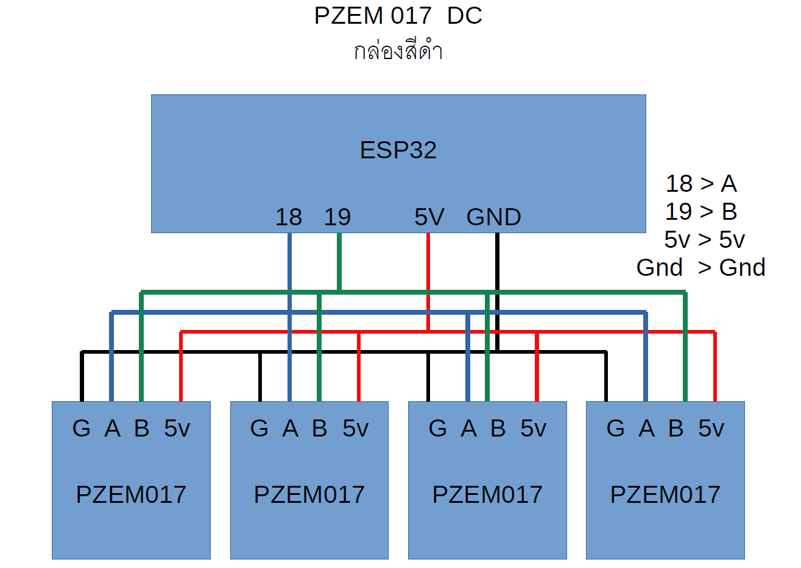

# pump_solarcell

## โค้ด
1. [โค้ดหลัก](https://raw.githubusercontent.com/canusorn/pump_solarcell/refs/heads/main/solar_pump_measure/solar_pump_measure.ino) เดี๋ยวเพิ่มคอมเม้นโค้ดให้ครับ
2. โค้ดเปลี่ยน Address Pzem017 กำลังทำให้ครับ
3. โค้ดเปลี่ยน Address Pzem004T กำลังทำให้ครับ

## อุปกรณ์
1. บอร์ด ESP32 พร้อมฐาน 1ตัว
2. pzem 004t v3  ac sensor 2ตัว
3. pzem017 50A dc sensor 2ตัว
4. pzem017 100A dc sensor 2ตัว
5. dht22 temp sensor 1ตัว

## Address เซนเซอร์แต่ละตัว
เซนเซอร์แต่ละตัว จะมี Address แยกแต่ละตัวให้แล้ว ทำให้ต่อขนานกันได้เลย

- PZEM017 1 - วัดไฟแผงเข้าชาร์จเจอร์
- PZEM017 2 - วัดไฟจากชาร์จเจอร์ เข้าแบตเตอร์รี่
- PZEM017 3 - วัดไฟจากแบตเตอร์รี่ เข้าอินเวอร์เตอร์ 220V
- PZEM017 4 - วัดไฟจากแบตเตอร์รี่ เข้าอินเวอร์เตอร์ปั้มน้ำ
- PZEM004T 1 - วัดไฟ ac เต้ารับ
- PZEM004T 2 - วัดไฟ ac ที่เข้าอินเวอร์เตอร์ปั้มน้ำ
## การต่อเซนเซอร์กับ ESP32

## การติดตั้งโปรแกรม และอัพโหลดโค้ด
[ติดตั้งและลงโปรแกรม](https://www.glab.co.th/post/%E0%B8%95%E0%B8%B4%E0%B8%94%E0%B8%95%E0%B8%B1%E0%B9%89%E0%B8%87-arduino-ide-2-0-%E0%B9%80%E0%B8%9E%E0%B8%B4%E0%B9%88%E0%B8%A1%E0%B8%9A%E0%B8%AD%E0%B8%A3%E0%B9%8C%E0%B8%94-node32s-%E0%B9%81%E0%B8%A5%E0%B9%89%E0%B8%A7%E0%B9%84%E0%B8%9F%E0%B8%81%E0%B8%A3%E0%B8%B0%E0%B8%9E%E0%B8%A3%E0%B8%B4%E0%B8%9A)

